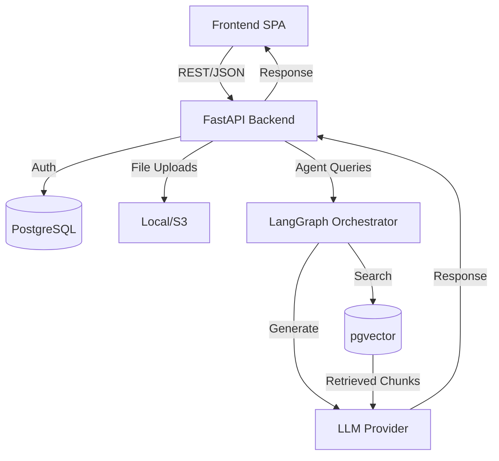

# System Architecture

CareerForge AI is a multi-tier SaaS application composed of:
1. **Frontend:** React + Vite + Tailwind SPA
2. **Backend:** FastAPI + PostgreSQL (pgvector)
3. **AI Layer:** LangGraph Multi-Agent System + Ollama/Anthropic
4. **Data Layer:** PostgreSQL (pgvector) for relational data and vector embeddings

## Core Components

### 1. Frontend
- Built with React, TypeScript, and Vite.
- Implements a modern SaaS UI with Tailwind CSS.
- Connects to the backend via a centralized `api.ts` Axios instance that injects JWT tokens automatically.
- State is managed via React Context (`AuthContext`).

### 2. Backend
- Built with FastAPI (Python 3.10+).
- **Asynchronous**: Uses `asyncpg` for non-blocking database queries and `httpx` for non-blocking AI API calls.
- **Security**: Features JWT authentication, role-based access control, file validation, and SlowAPI rate-limiting.

### 3. AI Layer & Agent Orchestration
- Utilizes **LangGraph** to coordinate 10 specialized AI agents under a Supervisor Agent.
- Each agent handles a specific domain (Resume, Jobs, GitHub, Interview, Projects, etc.).
- Agents share structured state (`AgentState`) to pass context (resumes, job targets) seamlessly.

### 4. RAG Pipeline (Retrieval-Augmented Generation)
- Text documents (Resumes, Jobs) are processed through `app.rag.pipeline`.
- Text is cleaned, chunked (fixed window or section-aware), and embedded using `nomic-embed-text` (or fallback).
- Embeddings are stored in PostgreSQL using the `pgvector` extension.
- Similarity searches use IVFFlat indexing for sub-millisecond retrieval speeds.

## Data Flow Diagram

